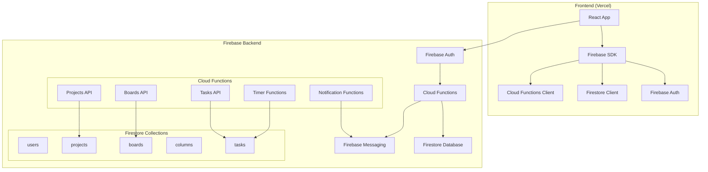

# TaskFlow Pro - Firebase Migration Plan

## Overview

This document outlines the complete migration plan for TaskFlow Pro from the current Express.js + MongoDB architecture to Firebase Cloud Functions + Firestore. This migration will provide better scalability, cost efficiency (free tier), real-time capabilities, and built-in authentication.

## Current Architecture Analysis

### Current Stack
- **Backend:** Node.js Express server with REST API
- **Database:** MongoDB with Mongoose ODM
- **Models:** Project → Board → Column → Task hierarchy
- **Authentication:** Disabled (prepared but unused)
- **Key Features:** CRUD operations, push notifications, timer functionality
- **Routes:** `/api/projects`, `/api/boards`, `/api/tasks` with nested endpoints

### Current Data Models
```javascript
// MongoDB Collections
Project: { name, description, owner, members[], boards[], createdAt }
Board: { name, project, columns[], createdAt }
Column: { name, board, tasks[], createdAt }
Task: { title, description, column, board, project, assignedTo, dueDate, status, priority, timeSpent, isRunning, isCompleted, createdAt }
```

## Proposed Firebase Architecture



## Data Model Migration: MongoDB → Firestore

### 1. Users Collection (New - Firebase Auth Integration)
```javascript
// Firestore: /users/{userId}
{
  uid: "firebase_auth_uid",
  email: "user@example.com", 
  displayName: "User Name",
  createdAt: timestamp,
  projects: ["project1_id", "project2_id"] // Array of project IDs user has access to
}
```

### 2. Projects Collection
```javascript
// Current MongoDB → Firestore: /projects/{projectId}
{
  name: "Project Name",
  description: "Project Description", 
  owner: "user_uid", // Changed from ObjectId to Firebase UID
  members: ["uid1", "uid2"], // Array of Firebase UIDs
  boards: ["board1_id", "board2_id"], // Array of board IDs
  createdAt: timestamp,
  updatedAt: timestamp
}
```

### 3. Boards Collection
```javascript
// Current MongoDB → Firestore: /boards/{boardId}
{
  name: "Board Name",
  projectId: "project_id", // Reference to parent project
  columns: ["col1_id", "col2_id", "col3_id"], // Array of column IDs
  createdAt: timestamp,
  updatedAt: timestamp
}
```

### 4. Columns Collection
```javascript
// Current MongoDB → Firestore: /columns/{columnId}  
{
  name: "To Do" | "In Progress" | "Done",
  boardId: "board_id", // Reference to parent board
  projectId: "project_id", // Denormalized for efficient queries
  order: 0, // Position in board
  tasks: ["task1_id", "task2_id"], // Array of task IDs
  createdAt: timestamp
}
```

### 5. Tasks Collection
```javascript
// Current MongoDB → Firestore: /tasks/{taskId}
{
  title: "Task Title",
  description: "Task Description",
  projectId: "project_id", // Denormalized references
  boardId: "board_id",
  columnId: "column_id", 
  assignedTo: "user_uid", // Firebase UID
  dueDate: timestamp,
  status: "to-do" | "in-progress" | "done",
  priority: "low" | "medium" | "high",
  timeSpent: 0, // seconds
  isRunning: false,
  isCompleted: false,
  createdAt: timestamp,
  updatedAt: timestamp
}
```

## Cloud Functions API Design

### Authentication Flow
- Replace custom auth middleware with Firebase Auth
- Use Firebase Auth tokens for API authentication
- Implement role-based access control using custom claims

### Core API Functions

#### 1. Projects Functions (`functions/src/projects.js`)
```javascript
const functions = require('firebase-functions');
const admin = require('firebase-admin');

exports.getProjects = functions.https.onCall(async (data, context) => {
  if (!context.auth) {
    throw new functions.https.HttpsError('unauthenticated', 'User must be authenticated');
  }
  
  const userId = context.auth.uid;
  const db = admin.firestore();
  
  // Query projects where user is owner or member
  const projectsSnapshot = await db.collection('projects')
    .where('owner', '==', userId)
    .get();
  
  const memberProjectsSnapshot = await db.collection('projects')
    .where('members', 'array-contains', userId)
    .get();
  
  // Combine and deduplicate results
  const projects = [];
  // Process results...
  
  return projects;
});

exports.createProject = functions.https.onCall(async (data, context) => {
  if (!context.auth) {
    throw new functions.https.HttpsError('unauthenticated', 'User must be authenticated');
  }
  
  const { name, description } = data;
  const userId = context.auth.uid;
  const db = admin.firestore();
  
  // Create project + default board + default columns atomically
  return db.runTransaction(async (transaction) => {
    const projectRef = db.collection('projects').doc();
    const boardRef = db.collection('boards').doc();
    
    // Create project
    transaction.set(projectRef, {
      name,
      description,
      owner: userId,
      members: [userId],
      boards: [boardRef.id],
      createdAt: admin.firestore.FieldValue.serverTimestamp(),
      updatedAt: admin.firestore.FieldValue.serverTimestamp()
    });
    
    // Create default board
    transaction.set(boardRef, {
      name: "Main Board",
      projectId: projectRef.id,
      columns: [], // Will be populated with default columns
      createdAt: admin.firestore.FieldValue.serverTimestamp(),
      updatedAt: admin.firestore.FieldValue.serverTimestamp()
    });
    
    // Create default columns
    const columnNames = ["To Do", "In Progress", "Done"];
    const columnIds = [];
    
    columnNames.forEach((name, index) => {
      const columnRef = db.collection('columns').doc();
      columnIds.push(columnRef.id);
      
      transaction.set(columnRef, {
        name,
        boardId: boardRef.id,
        projectId: projectRef.id,
        order: index,
        tasks: [],
        createdAt: admin.firestore.FieldValue.serverTimestamp()
      });
    });
    
    // Update board with column IDs
    transaction.update(boardRef, { columns: columnIds });
    
    return { projectId: projectRef.id, boardId: boardRef.id };
  });
});

exports.deleteProject = functions.https.onCall(async (data, context) => {
  if (!context.auth) {
    throw new functions.https.HttpsError('unauthenticated', 'User must be authenticated');
  }
  
  const { projectId } = data;
  const userId = context.auth.uid;
  const db = admin.firestore();
  
  // Verify ownership
  const projectDoc = await db.collection('projects').doc(projectId).get();
  if (!projectDoc.exists || projectDoc.data().owner !== userId) {
    throw new functions.https.HttpsError('permission-denied', 'Not authorized to delete this project');
  }
  
  // Cascade delete: project → boards → columns → tasks
  return db.runTransaction(async (transaction) => {
    // Delete all tasks in project
    const tasksSnapshot = await db.collection('tasks').where('projectId', '==', projectId).get();
    tasksSnapshot.docs.forEach(doc => transaction.delete(doc.ref));
    
    // Delete all columns in project
    const columnsSnapshot = await db.collection('columns').where('projectId', '==', projectId).get();
    columnsSnapshot.docs.forEach(doc => transaction.delete(doc.ref));
    
    // Delete all boards in project
    const boardsSnapshot = await db.collection('boards').where('projectId', '==', projectId).get();
    boardsSnapshot.docs.forEach(doc => transaction.delete(doc.ref));
    
    // Delete project
    transaction.delete(db.collection('projects').doc(projectId));
    
    return { success: true };
  });
});
```

#### 2. Boards Functions (`functions/src/boards.js`)
```javascript
exports.getBoards = functions.https.onCall(async (data, context) => {
  if (!context.auth) {
    throw new functions.https.HttpsError('unauthenticated', 'User must be authenticated');
  }
  
  const { projectId } = data;
  const db = admin.firestore();
  
  // Verify user has access to project
  const projectDoc = await db.collection('projects').doc(projectId).get();
  if (!projectDoc.exists) {
    throw new functions.https.HttpsError('not-found', 'Project not found');
  }
  
  const projectData = projectDoc.data();
  if (projectData.owner !== context.auth.uid && !projectData.members.includes(context.auth.uid)) {
    throw new functions.https.HttpsError('permission-denied', 'Access denied');
  }
  
  // Get boards with populated columns and tasks
  const boardsSnapshot = await db.collection('boards').where('projectId', '==', projectId).get();
  
  const boards = await Promise.all(boardsSnapshot.docs.map(async (boardDoc) => {
    const boardData = { id: boardDoc.id, ...boardDoc.data() };
    
    // Get columns for this board
    const columnsSnapshot = await db.collection('columns')
      .where('boardId', '==', boardDoc.id)
      .orderBy('order')
      .get();
    
    const columns = await Promise.all(columnsSnapshot.docs.map(async (columnDoc) => {
      const columnData = { id: columnDoc.id, ...columnDoc.data() };
      
      // Get tasks for this column
      const tasksSnapshot = await db.collection('tasks')
        .where('columnId', '==', columnDoc.id)
        .orderBy('createdAt')
        .get();
      
      columnData.tasks = tasksSnapshot.docs.map(taskDoc => ({
        id: taskDoc.id,
        ...taskDoc.data()
      }));
      
      return columnData;
    }));
    
    boardData.columns = columns;
    return boardData;
  }));
  
  return boards;
});

exports.createBoard = functions.https.onCall(async (data, context) => {
  if (!context.auth) {
    throw new functions.https.HttpsError('unauthenticated', 'User must be authenticated');
  }
  
  const { projectId, name } = data;
  const db = admin.firestore();
  
  // Verify user has access to project
  const projectDoc = await db.collection('projects').doc(projectId).get();
  if (!projectDoc.exists) {
    throw new functions.https.HttpsError('not-found', 'Project not found');
  }
  
  const projectData = projectDoc.data();
  if (projectData.owner !== context.auth.uid && !projectData.members.includes(context.auth.uid)) {
    throw new functions.https.HttpsError('permission-denied', 'Access denied');
  }
  
  // Create board + default columns atomically
  return db.runTransaction(async (transaction) => {
    const boardRef = db.collection('boards').doc();
    
    // Create board
    transaction.set(boardRef, {
      name,
      projectId,
      columns: [],
      createdAt: admin.firestore.FieldValue.serverTimestamp(),
      updatedAt: admin.firestore.FieldValue.serverTimestamp()
    });
    
    // Create default columns
    const columnNames = ["To Do", "In Progress", "Done"];
    const columnIds = [];
    
    columnNames.forEach((columnName, index) => {
      const columnRef = db.collection('columns').doc();
      columnIds.push(columnRef.id);
      
      transaction.set(columnRef, {
        name: columnName,
        boardId: boardRef.id,
        projectId,
        order: index,
        tasks: [],
        createdAt: admin.firestore.FieldValue.serverTimestamp()
      });
    });
    
    // Update board with column IDs
    transaction.update(boardRef, { columns: columnIds });
    
    // Update project with board ID
    transaction.update(db.collection('projects').doc(projectId), {
      boards: admin.firestore.FieldValue.arrayUnion(boardRef.id),
      updatedAt: admin.firestore.FieldValue.serverTimestamp()
    });
    
    return { boardId: boardRef.id };
  });
});
```

#### 3. Tasks Functions (`functions/src/tasks.js`)
```javascript
exports.getTasks = functions.https.onCall(async (data, context) => {
  if (!context.auth) {
    throw new functions.https.HttpsError('unauthenticated', 'User must be authenticated');
  }
  
  const { projectId, boardId, columnId } = data;
  const db = admin.firestore();
  
  // Build query based on provided filters
  let query = db.collection('tasks');
  
  if (projectId) query = query.where('projectId', '==', projectId);
  if (boardId) query = query.where('boardId', '==', boardId);
  if (columnId) query = query.where('columnId', '==', columnId);
  
  const tasksSnapshot = await query.orderBy('createdAt').get();
  
  return tasksSnapshot.docs.map(doc => ({
    id: doc.id,
    ...doc.data()
  }));
});

exports.createTask = functions.https.onCall(async (data, context) => {
  if (!context.auth) {
    throw new functions.https.HttpsError('unauthenticated', 'User must be authenticated');
  }
  
  const { projectId, boardId, columnId, title, description, dueDate, priority, status } = data;
  const db = admin.firestore();
  
  // Verify user has access to project
  const projectDoc = await db.collection('projects').doc(projectId).get();
  if (!projectDoc.exists) {
    throw new functions.https.HttpsError('not-found', 'Project not found');
  }
  
  const projectData = projectDoc.data();
  if (projectData.owner !== context.auth.uid && !projectData.members.includes(context.auth.uid)) {
    throw new functions.https.HttpsError('permission-denied', 'Access denied');
  }
  
  const taskRef = db.collection('tasks').doc();
  
  await taskRef.set({
    title,
    description: description || '',
    projectId,
    boardId,
    columnId,
    assignedTo: context.auth.uid,
    dueDate: dueDate ? admin.firestore.Timestamp.fromDate(new Date(dueDate)) : null,
    status: status || 'to-do',
    priority: priority || 'medium',
    timeSpent: 0,
    isRunning: false,
    isCompleted: false,
    createdAt: admin.firestore.FieldValue.serverTimestamp(),
    updatedAt: admin.firestore.FieldValue.serverTimestamp()
  });
  
  // Update column's tasks array
  await db.collection('columns').doc(columnId).update({
    tasks: admin.firestore.FieldValue.arrayUnion(taskRef.id),
    updatedAt: admin.firestore.FieldValue.serverTimestamp()
  });
  
  return { taskId: taskRef.id };
});

exports.updateTask = functions.https.onCall(async (data, context) => {
  if (!context.auth) {
    throw new functions.https.HttpsError('unauthenticated', 'User must be authenticated');
  }
  
  const { taskId, updates } = data;
  const db = admin.firestore();
  
  const taskRef = db.collection('tasks').doc(taskId);
  const taskDoc = await taskRef.get();
  
  if (!taskDoc.exists) {
    throw new functions.https.HttpsError('not-found', 'Task not found');
  }
  
  // Verify user has access to project
  const taskData = taskDoc.data();
  const projectDoc = await db.collection('projects').doc(taskData.projectId).get();
  const projectData = projectDoc.data();
  
  if (projectData.owner !== context.auth.uid && !projectData.members.includes(context.auth.uid)) {
    throw new functions.https.HttpsError('permission-denied', 'Access denied');
  }
  
  // Handle column changes
  if (updates.columnId && updates.columnId !== taskData.columnId) {
    return db.runTransaction(async (transaction) => {
      // Remove from old column
      transaction.update(db.collection('columns').doc(taskData.columnId), {
        tasks: admin.firestore.FieldValue.arrayRemove(taskId)
      });
      
      // Add to new column
      transaction.update(db.collection('columns').doc(updates.columnId), {
        tasks: admin.firestore.FieldValue.arrayUnion(taskId)
      });
      
      // Update task
      transaction.update(taskRef, {
        ...updates,
        updatedAt: admin.firestore.FieldValue.serverTimestamp()
      });
      
      return { success: true };
    });
  } else {
    // Simple update
    await taskRef.update({
      ...updates,
      updatedAt: admin.firestore.FieldValue.serverTimestamp()
    });
    
    return { success: true };
  }
});

exports.startTimer = functions.https.onCall(async (data, context) => {
  if (!context.auth) {
    throw new functions.https.HttpsError('unauthenticated', 'User must be authenticated');
  }
  
  const { taskId } = data;
  const db = admin.firestore();
  
  const taskRef = db.collection('tasks').doc(taskId);
  const taskDoc = await taskRef.get();
  
  if (!taskDoc.exists) {
    throw new functions.https.HttpsError('not-found', 'Task not found');
  }
  
  await taskRef.update({
    isRunning: true,
    lastStartTime: admin.firestore.FieldValue.serverTimestamp(),
    updatedAt: admin.firestore.FieldValue.serverTimestamp()
  });
  
  return { success: true };
});

exports.stopTimer = functions.https.onCall(async (data, context) => {
  if (!context.auth) {
    throw new functions.https.HttpsError('unauthenticated', 'User must be authenticated');
  }
  
  const { taskId, timeElapsed } = data;
  const db = admin.firestore();
  
  const taskRef = db.collection('tasks').doc(taskId);
  const taskDoc = await taskRef.get();
  
  if (!taskDoc.exists) {
    throw new functions.https.HttpsError('not-found', 'Task not found');
  }
  
  const currentTimeSpent = taskDoc.data().timeSpent || 0;
  
  await taskRef.update({
    isRunning: false,
    timeSpent: currentTimeSpent + timeElapsed,
    lastStartTime: admin.firestore.FieldValue.delete(),
    updatedAt: admin.firestore.FieldValue.serverTimestamp()
  });
  
  return { success: true };
});
```

#### 4. Notification Functions (`functions/src/notifications.js`)
```javascript
exports.sendTaskNotification = functions.firestore
  .document('tasks/{taskId}')
  .onUpdate(async (change, context) => {
    const before = change.before.data();
    const after = change.after.data();
    
    // Check if status changed
    if (before.status !== after.status) {
      const messaging = admin.messaging();
      
      // Get project members to notify
      const projectDoc = await admin.firestore().collection('projects').doc(after.projectId).get();
      const projectData = projectDoc.data();
      
      const notifications = [];
      
      // Send notification to all project members
      for (const memberId of projectData.members) {
        if (memberId !== after.assignedTo) { // Don't notify the person who made the change
          const userDoc = await admin.firestore().collection('users').doc(memberId).get();
          const userData = userDoc.data();
          
          if (userData.fcmToken) {
            notifications.push({
              token: userData.fcmToken,
              notification: {
                title: 'Task Updated',
                body: `Task "${after.title}" moved to ${after.status}`
              },
              data: {
                taskId: context.params.taskId,
                projectId: after.projectId,
                boardId: after.boardId
              }
            });
          }
        }
      }
      
      if (notifications.length > 0) {
        await messaging.sendAll(notifications);
      }
    }
  });

exports.sendDueDateReminder = functions.pubsub
  .schedule('every day 09:00')
  .timeZone('UTC')
  .onRun(async (context) => {
    const db = admin.firestore();
    const messaging = admin.messaging();
    
    // Get tasks due today
    const today = new Date();
    today.setHours(0, 0, 0, 0);
    
    const tomorrow = new Date(today);
    tomorrow.setDate(tomorrow.getDate() + 1);
    
    const tasksSnapshot = await db.collection('tasks')
      .where('dueDate', '>=', admin.firestore.Timestamp.fromDate(today))
      .where('dueDate', '<', admin.firestore.Timestamp.fromDate(tomorrow))
      .where('isCompleted', '==', false)
      .get();
    
    const notifications = [];
    
    for (const taskDoc of tasksSnapshot.docs) {
      const taskData = taskDoc.data();
      
      if (taskData.assignedTo) {
        const userDoc = await db.collection('users').doc(taskData.assignedTo).get();
        const userData = userDoc.data();
        
        if (userData.fcmToken) {
          notifications.push({
            token: userData.fcmToken,
            notification: {
              title: 'Task Due Today',
              body: `Don't forget: "${taskData.title}" is due today!`
            },
            data: {
              taskId: taskDoc.id,
              projectId: taskData.projectId,
              boardId: taskData.boardId
            }
          });
        }
      }
    }
    
    if (notifications.length > 0) {
      await messaging.sendAll(notifications);
    }
    
    return null;
  });
```

## Firebase Authentication Integration

### Frontend Authentication Flow
```javascript
// New: frontend/src/firebase/auth.js
import { initializeApp } from 'firebase/app';
import { 
  getAuth, 
  signInWithEmailAndPassword, 
  createUserWithEmailAndPassword,
  signOut,
  onAuthStateChanged 
} from 'firebase/auth';

const firebaseConfig = {
  apiKey: import.meta.env.VITE_FIREBASE_API_KEY,
  authDomain: import.meta.env.VITE_FIREBASE_AUTH_DOMAIN,
  projectId: import.meta.env.VITE_FIREBASE_PROJECT_ID,
  storageBucket: import.meta.env.VITE_FIREBASE_STORAGE_BUCKET,
  messagingSenderId: import.meta.env.VITE_FIREBASE_MESSAGING_SENDER_ID,
  appId: import.meta.env.VITE_FIREBASE_APP_ID
};

const app = initializeApp(firebaseConfig);
export const auth = getAuth(app);

export const getCurrentUser = () => auth.currentUser;
export const getIdToken = () => auth.currentUser?.getIdToken();

export const signIn = (email, password) => signInWithEmailAndPassword(auth, email, password);
export const signUp = (email, password) => createUserWithEmailAndPassword(auth, email, password);
export const logout = () => signOut(auth);

export const onAuthStateChange = (callback) => onAuthStateChanged(auth, callback);
```

### Updated API Client
```javascript
// Updated: frontend/src/services/api.js
import { httpsCallable } from 'firebase/functions';
import { functions } from '../firebase/config';

// Replace REST API calls with Cloud Functions
export const getProjects = httpsCallable(functions, 'getProjects');
export const createProject = httpsCallable(functions, 'createProject');
export const deleteProject = httpsCallable(functions, 'deleteProject');

export const getBoards = httpsCallable(functions, 'getBoards');
export const createBoard = httpsCallable(functions, 'createBoard');

export const getTasks = httpsCallable(functions, 'getTasks');
export const createTask = httpsCallable(functions, 'createTask');
export const updateTask = httpsCallable(functions, 'updateTask');
export const startTimer = httpsCallable(functions, 'startTimer');
export const stopTimer = httpsCallable(functions, 'stopTimer');

// Real-time listeners for live updates
import { onSnapshot, collection, query, where } from 'firebase/firestore';
import { db } from '../firebase/config';

export const subscribeToTasks = (projectId, boardId, columnId, callback) => {
  let q = collection(db, 'tasks');
  
  if (projectId) q = query(q, where('projectId', '==', projectId));
  if (boardId) q = query(q, where('boardId', '==', boardId));
  if (columnId) q = query(q, where('columnId', '==', columnId));
  
  return onSnapshot(q, (snapshot) => {
    const tasks = snapshot.docs.map(doc => ({
      id: doc.id,
      ...doc.data()
    }));
    callback(tasks);
  });
};
```

## Security Rules (Firestore)

```javascript
rules_version = '2';
service cloud.firestore {
  match /databases/{database}/documents {
    // Users can read/write their own user document
    match /users/{userId} {
      allow read, write: if request.auth != null && request.auth.uid == userId;
    }
    
    // Projects: users can access projects they own or are members of
    match /projects/{projectId} {
      allow read, write: if request.auth != null && 
        (request.auth.uid == resource.data.owner ||
         request.auth.uid in resource.data.members);
    }
    
    // Boards: inherit project permissions
    match /boards/{boardId} {
      allow read, write: if request.auth != null && 
        exists(/databases/$(database)/documents/projects/$(resource.data.projectId)) &&
        (request.auth.uid == get(/databases/$(database)/documents/projects/$(resource.data.projectId)).data.owner ||
         request.auth.uid in get(/databases/$(database)/documents/projects/$(resource.data.projectId)).data.members);
    }
    
    // Columns: inherit project permissions
    match /columns/{columnId} {
      allow read, write: if request.auth != null && 
        exists(/databases/$(database)/documents/projects/$(resource.data.projectId)) &&
        (request.auth.uid == get(/databases/$(database)/documents/projects/$(resource.data.projectId)).data.owner ||
         request.auth.uid in get(/databases/$(database)/documents/projects/$(resource.data.projectId)).data.members);
    }
    
    // Tasks: inherit project permissions
    match /tasks/{taskId} {
      allow read, write: if request.auth != null && 
        exists(/databases/$(database)/documents/projects/$(resource.data.projectId)) &&
        (request.auth.uid == get(/databases/$(database)/documents/projects/$(resource.data.projectId)).data.owner ||
         request.auth.uid in get(/databases/$(database)/documents/projects/$(resource.data.projectId)).data.members);
    }
  }
}
```

## Deployment Configuration

### Firebase Project Structure
```
firebase/
├── .firebaserc                 # Firebase project config
├── firebase.json              # Firebase services config
├── firestore.rules            # Database security rules
├── firestore.indexes.json     # Database indexes
└── functions/
    ├── package.json
    ├── index.js               # Functions entry point
    └── src/
        ├── projects.js        # Projects API
        ├── boards.js         # Boards API  
        ├── tasks.js          # Tasks API
        ├── notifications.js  # Push notifications
        └── middleware/
            └── auth.js       # Authentication middleware
```

### Firebase Configuration Files

#### `firebase.json`
```json
{
  "functions": {
    "source": "functions",
    "runtime": "nodejs18",
    "predeploy": ["npm --prefix functions run build"]
  },
  "firestore": {
    "rules": "firestore.rules",
    "indexes": "firestore.indexes.json"
  },
  "hosting": {
    "public": "public",
    "ignore": ["firebase.json", "**/.*", "**/node_modules/**"],
    "rewrites": [
      {
        "source": "**",
        "destination": "/index.html"
      }
    ]
  }
}
```

#### `.firebaserc`
```json
{
  "projects": {
    "default": "taskflow-pro-production"
  }
}
```

#### `functions/package.json`
```json
{
  "name": "taskflow-functions",
  "version": "1.0.0",
  "main": "index.js",
  "dependencies": {
    "firebase-admin": "^12.0.0",
    "firebase-functions": "^4.0.0"
  },
  "engines": {
    "node": "18"
  }
}
```

#### Environment Variables
```bash
# Firebase Functions environment
firebase functions:config:set \
  app.frontend_url="https://your-app.vercel.app" \
  vapid.public_key="your-vapid-public-key" \
  vapid.private_key="your-vapid-private-key"
```

## Migration Steps and Timeline

### Phase 1: Environment Setup (Week 1)
**Duration:** 3-5 days  
**Risk Level:** Low

#### Day 1-2: Firebase Project Setup
- [ ] Create Firebase project in console
- [ ] Install Firebase CLI and initialize project
- [ ] Configure Firestore database
- [ ] Set up Firebase Authentication
- [ ] Configure security rules (basic)

#### Day 3-4: Development Environment
- [ ] Set up local Firebase emulators
- [ ] Configure environment variables
- [ ] Update frontend build configuration
- [ ] Test Firebase connection

#### Day 5: Initial Functions Structure
- [ ] Create basic Cloud Functions structure
- [ ] Set up authentication middleware
- [ ] Deploy "hello world" function to test

### Phase 2: Data Migration (Week 2)
**Duration:** 5-7 days  
**Risk Level:** Medium

#### Day 1-2: Data Export & Transform
- [ ] Export data from current MongoDB
- [ ] Write migration scripts (MongoDB → Firestore format)
- [ ] Test data transformation locally

#### Day 3-4: Firestore Import
- [ ] Import transformed data to Firestore
- [ ] Verify data integrity and relationships
- [ ] Set up Firestore indexes

#### Day 5-7: Data Validation
- [ ] Create data validation scripts
- [ ] Test complex queries and relationships
- [ ] Backup and rollback procedures

### Phase 3: Backend Migration (Week 3-4)
**Duration:** 10-12 days  
**Risk Level:** High

#### Week 3: Core API Functions
- [ ] Migrate Projects API to Cloud Functions
- [ ] Migrate Boards API to Cloud Functions  
- [ ] Migrate Tasks API to Cloud Functions
- [ ] Implement authentication in all functions

#### Week 4: Advanced Features
- [ ] Migrate timer functionality
- [ ] Implement push notifications with Firebase Messaging
- [ ] Set up real-time listeners
- [ ] Performance optimization

### Phase 4: Frontend Integration (Week 5)
**Duration:** 5-7 days  
**Risk Level:** Medium

#### Day 1-2: Firebase SDK Integration
- [ ] Install Firebase SDK in frontend
- [ ] Replace API client with Firebase calls
- [ ] Implement Firebase Auth UI

#### Day 3-4: Real-time Features
- [ ] Replace polling with Firestore listeners
- [ ] Update state management for real-time data
- [ ] Test collaborative features

#### Day 5-7: Testing & Polish
- [ ] End-to-end testing
- [ ] Error handling improvements
- [ ] Performance optimization

### Phase 5: Deployment & Go-Live (Week 6)
**Duration:** 3-5 days  
**Risk Level:** Medium

#### Day 1-2: Production Setup
- [ ] Configure production Firebase project
- [ ] Set up monitoring and logging
- [ ] Final security rules review

#### Day 3-4: Deployment
- [ ] Deploy Cloud Functions to production
- [ ] Deploy frontend to Vercel (updated)
- [ ] DNS and domain configuration

#### Day 5: Go-Live
- [ ] Final testing in production
- [ ] Monitor performance and errors
- [ ] User acceptance testing

## Risk Assessment & Mitigation

### High-Risk Areas
1. **Data Migration Integrity**
   - *Risk:* Data loss or corruption during migration
   - *Mitigation:* Multiple backups, staged migration, extensive testing

2. **Real-time Functionality**
   - *Risk:* Performance issues with Firestore listeners
   - *Mitigation:* Optimize queries, implement pagination, connection pooling

3. **Authentication Changes**
   - *Risk:* User session disruption
   - *Mitigation:* Gradual rollout, fallback mechanisms

### Medium-Risk Areas
1. **Cloud Functions Cold Starts**
   - *Risk:* Initial request latency
   - *Mitigation:* Keep functions warm, optimize bundle size

2. **API Endpoint Changes**
   - *Risk:* Frontend compatibility issues
   - *Mitigation:* Maintain API contract, thorough testing

## Success Criteria

### Performance Metrics
- [ ] API response time < 200ms (95th percentile)
- [ ] Real-time updates < 100ms latency
- [ ] Firebase free tier limits not exceeded

### Functionality Verification
- [ ] All current features working in Firebase version
- [ ] Real-time collaboration functional
- [ ] Push notifications working
- [ ] Data integrity maintained

### User Experience
- [ ] No user account migration required
- [ ] Improved real-time experience
- [ ] Better offline support

## Cost Analysis

### Firebase Free Tier Limits
- **Cloud Functions:** 2M invocations/month
- **Firestore:** 50K reads, 20K writes, 20K deletes/day
- **Authentication:** Unlimited users
- **Hosting:** 10GB storage, 10GB/month transfer
- **Cloud Messaging:** Unlimited notifications

### Estimated Usage (Small-Medium App)
- **Daily Active Users:** 50-100
- **API Calls:** ~5K/day (well within limits)
- **Database Operations:** ~2K reads, 500 writes/day
- **Expected Cost:** $0/month (free tier sufficient)

### Scaling Considerations
If usage exceeds free tier:
- **Firestore:** $0.18 per 100K reads, $0.18 per 100K writes
- **Cloud Functions:** $0.40 per million invocations
- **Still significantly cheaper than hosted alternatives**

## Benefits Summary

### Technical Benefits
✅ **Auto-scaling:** No server management required  
✅ **Real-time:** Native real-time updates with Firestore listeners  
✅ **Offline Support:** Built-in offline capabilities  
✅ **Security:** Database-level security rules  
✅ **Authentication:** Integrated Firebase Auth  
✅ **Monitoring:** Built-in logging and error tracking  

### Cost Benefits
✅ **Free Tier:** Generous free limits for small-medium apps  
✅ **Pay-as-you-scale:** Only pay for what you use  
✅ **No Infrastructure:** No server, database, or hosting costs  

### Development Benefits
✅ **Less Code:** Built-in features reduce custom code  
✅ **Better Testing:** Firebase emulators for local development  
✅ **Easier Deployment:** Single command deployment  
✅ **Better Analytics:** Built-in usage analytics  

## Migration Alternatives Considered

### Alternative 1: Keep Express.js + Deploy to Render
- **Pros:** Minimal code changes, faster migration
- **Cons:** Limited free tier, no real-time features, manual scaling

### Alternative 2: Express.js + Deploy to Fly.io
- **Pros:** Good free allowances, Docker deployment
- **Cons:** More complex deployment, limited real-time features

### Recommendation: Firebase Migration
Firebase offers the best long-term value with:
- Most generous free tier
- Built-in real-time and offline capabilities
- Better scalability and security
- Modern development experience

While the migration requires more effort upfront, the benefits significantly outweigh the costs for a project management application like TaskFlow Pro.